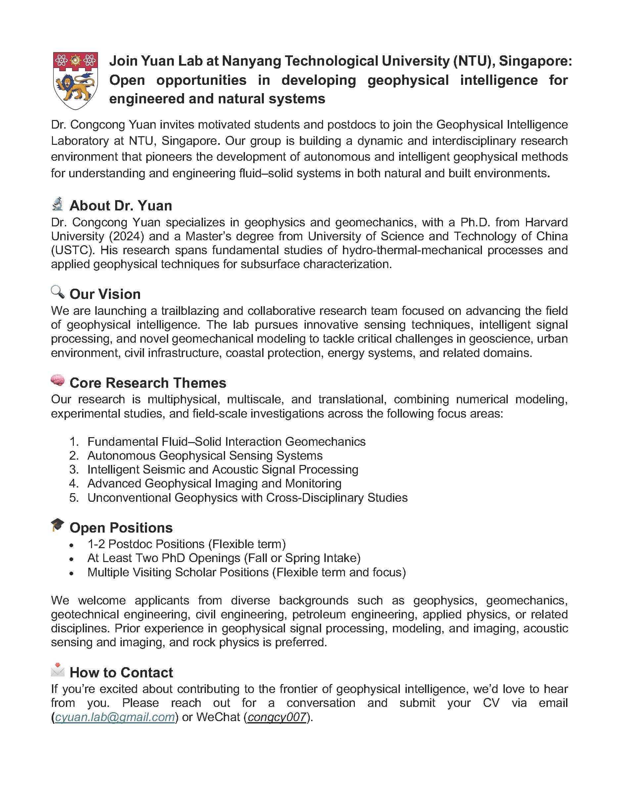

I am currently a postdoc at the department of Earth and Atmospheric Sciences at Cornell University. Before that, I obtained my Ph.D. in geophysics at Harvard University, under the supervision of [Marine Denolle](https://en.ess.ustc.edu.cn/2012/0827/c27105a92978/page.htm), [John Shaw](https://structure.harvard.edu/), and [David Weitz](https://weitzlab.seas.harvard.edu/)

As a geophysicist, I am studying seismoacoustic wave physics and mechanical processes to understand and infer earthquake physics, fracturing dynamics, fluid-fracture/fault interactive mechanisms, and material mechanical properties from laboratory to Earth scales. My recent research is centered around understanding and reconstructing subterranean activities associated with fractures, faults, and fluids. Specifically, how do fluids affect subsurface mechanical properties? how do fluids interact with fractures and/or faults? how to manage and foresee seismic risk and/or fluid leakage? To answer these questions, I conduct multidimensional studies, encompassing laboratory experiments, computational simulations, and observational data analysis. Ultimately, my goal is to effectively inform subsurface activities and potential risks for environmental and energy sustainability.

Aside from the research, I prefer music, basketball, and hiking for my entertainment.

***

## Recent News
### ** Oct 7, 2025**
📢 I will join NTU Singapore this November. I am looking for postdocs, phds, and visitors. Plz contact me (cyuan.lab@gmail.com) if anything below interests you.

### 📅 ** April 12, 2025**
📢 I will be sharing two laboratory studies at SSA annaul meeting: 🔹1. Mechanical and Acoustic Response of Laboratory Fault-valve Media to Fluid Injections [Oral session: Mechanistic Insights into Fluid-induced Earthquakes from the Laboratory to the Field - II][📍 Key Ballroom 12][🗓 4/15/2025]  🔹2. Seismic Monitoring Analogs for Hydrothermal Processes in Controlled Fracture Networks [Poster session:  Seismology for the Energy Transition][🗓 4/16/2025]. 

***
------
<!-- 

  

    
  

 -->
<!-- ### 📅 ** April 17, 2023** -->

<!-- 🎉 **Exciting Announcement!** -->
<!-- 📢 I'll be presenting a talk at the AGU conference on December 12th! 🌟 [Here](https://drive.google.com/file/d/1HEmNvDAKZOXKDXD6uf0pXXWqe8fAPPK5/view?usp=sharing) is the early-released talk I recorded. #[AGU2023](https://www.agu.org/fall-meeting)-[T22A-06](https://agu.confex.com/agu/fm23/meetingapp.cgi/Paper/1297631) -->

<!-- 📢 Excited to announce that I'll be presenting two posters at the SSA conference this Wednesday! 🌟 Join in me exploring ELEP and SmartFilter for earthquake data processing. Can't wait to share our progress and connect with fellows. #SSA23

<!-- I'm thrilled to announce that I've migrated my personal website from [Notion version](https://www.notion.so/congcongyuan/Congcong-Yuan-ec3bd07b959c42978e6e90d41b4f75b9?pvs=4) to this new version. Stay tuned for more updates! -->

<!-- 📚 **New Publication**
My latest paper, titled "Innovations in Deep Learning for Text Analysis," has been published in the prestigious Journal of Artificial Intelligence Research. Check it out [here](https://example.com/your-paper-link)!

🏆 **Award Received**
I'm honored to have received the Best Paper Award at the International Conference on Machine Learning for my work on reinforcement learning algorithms. A huge thanks to my collaborators and everyone who supported our research.

### 📅 **February 28, 2023**

👩‍💻 **Joined New Project**
I've recently joined an exciting collaborative project focused on developing state-of-the-art AI solutions for healthcare. Can't wait to share more details soon!

🎙️ **Guest Lecture**
I had the pleasure of giving a guest lecture on "The Future of AI in Industry" at the University of Technology. The recording is now available [here](https://example.com/your-lecture-link). -->
