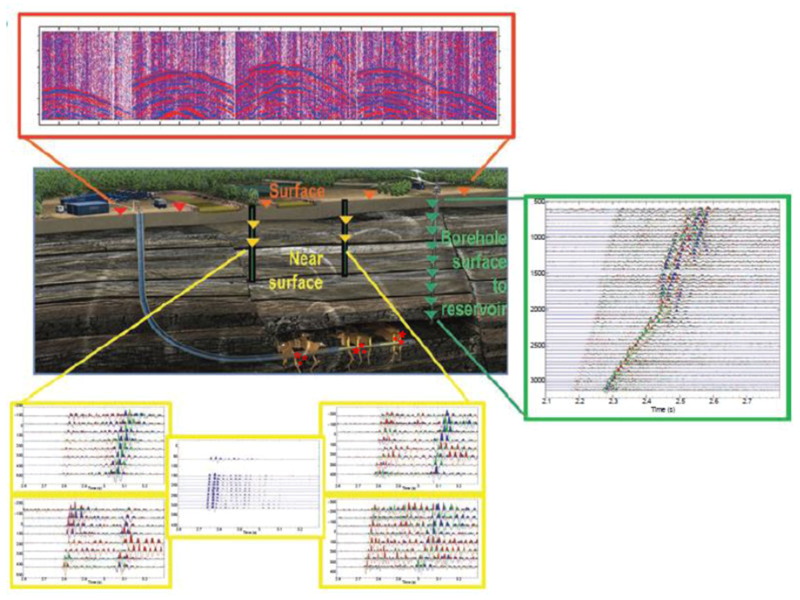
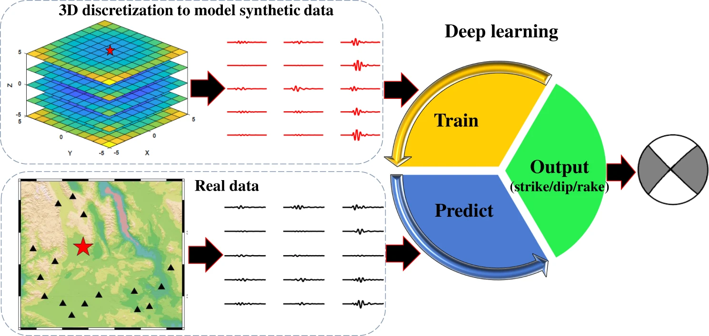
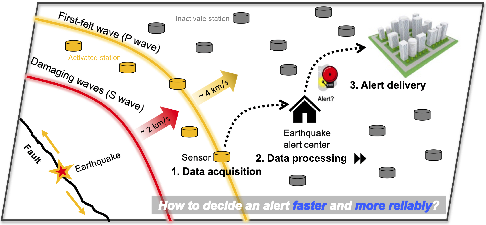
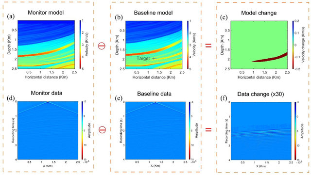
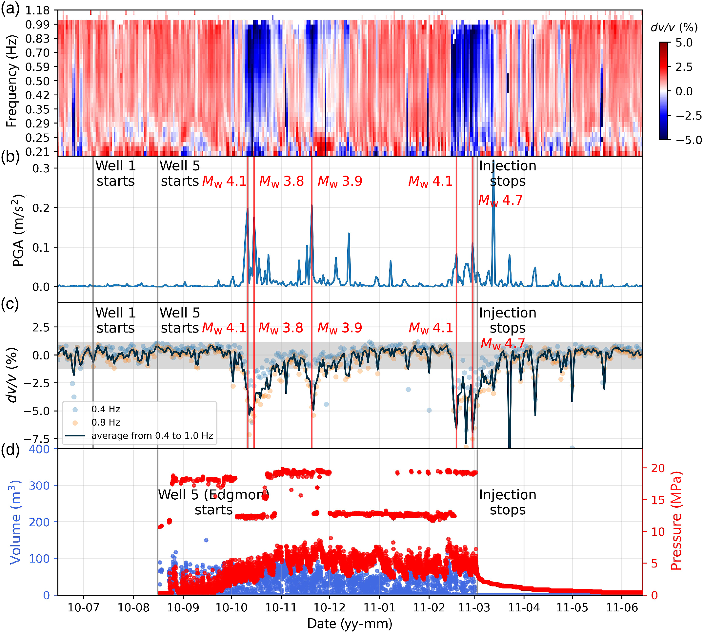



## High-performance Earthquake Monitoring

### 1. Hydraulic Fracturing & Microseismic monitoring

Microseismic monitoring plays an increasingly important role in mining, reservoir fracturing, flooding as well as recovery. For example, microseismic monitoring has become the key technique to image hydraulic fractures. The simulated reservoir volume can be estimated based on the fracture network or change in rock property caused by hydraulic fracturing treatment, which helps the site engineer to evaluate hydraulic fracturing and perform the next fracturing treatment. Tree available approaches are mainly utilized to estimate simulated reservoir volume:

1. characterize fracture geometry and size in terms of event location and moment
2. image directly fractures or faults produced in stimulated areas
3. invert for the geomechanic parameters of stimulated areas, such as velocity ratio or Poisson’s ratio

**Selected publications:**

- **Yuan, C.** & Zhang*, J. (2018) A feasibility study of imaging hydraulic fractures with anisotropic reverse time migration. *Journal of Applied Geophysics*, *155*, 199-207. [**doi:** [10.1016/j.jappgeo.2018.05.015](http://dx.doi.org/10.1016/j.jappgeo.2018.05.015)]
- **Yuan, C.**, Jia*, X., Liu, S. & Zhang, J. (2018) Microseismic reverse time migration with a multi-cross-correlation staining algorithm for fracture imaging. *Journal of Applied Geophysics*, *149*, 95-104. [**doi:** [10.1016/j.jappgeo.2017.12.019](http://dx.doi.org/10.1016/j.jappgeo.2017.12.019)]
- Ma, Y., **Yuan, C.** & Zhang*, J. (2020) Joint inversion for microseismic event locations and anisotropic parameters with the cross double-difference method in VTI media. *Geophysics, 85*(3), 1-41. [**doi:** [10.1190/geo2019-0325.1](https://doi.org/10.1190/geo2019-0325.1)]
- **Yuan, C.,** Zhang*, W. & Zhang, J. (2020) Automatic microseismic stacking location with a multi-cross-correlation condition. *EarthArXiv preprint.* [**doi:** [10.31223/X5KK6T](https://doi.org/10.31223/X5KK6T)]
- **Yuan, C.**, Zhang, X. & Zhang*, J. (2021) 3D microseismic imaging for identifying shale sweet spot. *EarthArXiv preprint.* [**doi:** [10.31223/X5689F](https://doi.org/10.31223/X5689F)]

### 2. Earthquake Signal Processing

Through understanding and deciphering the features from seismograms, we aim to build up a high-performance framework namely “QuakeAI” that fast and accurately inverts those waveform features for earthquake source parameters, including earthquake location, magnitude, and rupture mechanisms, by mainly leveraging the machine learning algorithms.

**Selected publications:**

- **Yuan, C.** & Zhang*, J. (2019) Applying deep learning to teleseismic phase detection and picking: PcP and PKiKP cases. *ArXiv preprint.* [**doi:** [1910.09049](https://arxiv.org/abs/1910.09049)]
- Zhang, X., Zhang*, J., **Yuan, C.**, Liu, S., Chen, Z. & Li, W. (2020) Locating earthquakes with a network of seismic stations via a deep learning method. *Scientific Report, 10,* 1941. [**doi:** [10.1038/s41598-020-58908-5](https://doi.org/10.1038/s41598-020-58908-5)]
- Kuang*, W., **Yuan, C.** & Zhang*, J. (2021) Real-time determination of earthquake focal mechanism via deep learning. *Nature Communications, 12*, 1432. [**doi:** [10.1038/s41467-021-21670-x](https://doi.org/10.1038/s41467-021-21670-x)]
- Kuang*, W., **Yuan, C.** & Zhang, J. (2021) Network-based earthquake magnitude determination via deep learning. *Seismological Research Letter.* [**doi:** [10.1785/0220200317](https://doi.org/10.1785/0220200317)].
- Kuang, W., **Yuan, C.**, Zhang, J. & Zhang*, W. Autonomous Earthquake Robot-Deep Reinforcement Learning for End-to-End Earthquake Location. *Communications Earth & Environment.* [Under review]

### 3. Earthquake Early Warning & Forecasting

The studies focus on seeking solutions for more efficient and accurate determination of earthquake source parameters and ground motion intensity before launching an early warning to the public. Currently, we are leveraging machine-learning algorithms to reach the goal of fast and reliable earthquake early warnings. I am concerned with two questions: 1) how “fast” will mainly depend on the algorithm design and runtime environment and 2) how “reliable” will be mainly decided by the algorithm performance and the input waveform quality. Based on the developing toolkit (”QuakeAI”), we aim to dispatch lightweight and powerful alerting systems into various seismic scenarios. 

---

## Multi-scale Structural Monitoring

### 1. Time-lapse Monitoring Approaches

 

Temporal changes in subsurface properties, such as seismic wave speeds and attenuation, can be monitored by extracting variations in continuous observed or empirical seismic waveforms. We are interested in developing 1. new approaches to resolving the tempo-spatial changes of seismic properties of the Earth materials, in particular for depth resolution; 2. high-performance tools to fast cross-correlate seismic noise and recognize repeating slow and fast earthquakes. 

**Selected publications:**

- **Yuan, C.**, Zhang, X., Jia, X. & Zhang*, J. (2019) Time-lapse velocity imaging via deep learning. *Geophysical Journal International, 220*(2)*,* 1228-1241. [**doi:** [10.1093/gji/ggz511](https://doi.org/10.1093/gji/ggz511)]
- **Yuan*, C.**, Bryan, J. & Denolle, M. A. (2021) Numerical comparison of time-, frequency-, and wavelet-domain methods for coda wave interferometry. *Geophysical Journal International.* [**doi:** [10.1093/gji/ggab140](https://doi.org/10.1093/gji/ggab140)].

### 2. Time-lapse Monitoring Applications

To demonstrate the usefulness of our methods, we apply them in various scenarios for monitoring purposes, such as wastewater injection, groundwater levels, magma inflation and deflation, earthquake rupture, and near-surface weathering. 

**Selected publications:**

- Yang, Z., **Yuan, C.** & Denolle*, M. (2022) Detecting Elevated Pore Pressure in the Guy-Greenbrier Fault Zone using Ambient Noise Monitoring. *The Seismic Record.* [**doi:** [10.1785/0320210036](https://doi.org/10.1785/0320210036)]

---

## Laboratory & Numerical Fracture & Fluid Mechanics

### 1. Visualizing & Listening to Fluid-induced Fracturing

Check out our fracturing animations from 1. [high_viscosity fluid](https://drive.google.com/file/d/1vr9rhLFWpas1HgIyy1EzmHkTuIoM5RPO/view?usp=sharing); 2. [low-viscosity fluid](https://drive.google.com/file/d/10FHtwsOBSn-2d39wFejzrWumadC3VDPp/view?usp=sharing)

The modes of fracturing in Earth materials exhibit a wide spectrum of time and length scales. The upper bound of the rupture velocity is close to shear-wave speed while the lower bound is not well known. For example, tremors are characterized by the seismic signals observed accompanying the aseismic slip signals, which reflects a complexity in the rupture mechanism compared to the classical earthquake.

### 2. Visualizing & Listening to Fluid-induced Frictional Slips

### 3. Non-linear changes in mechanical properties of laboratory materials